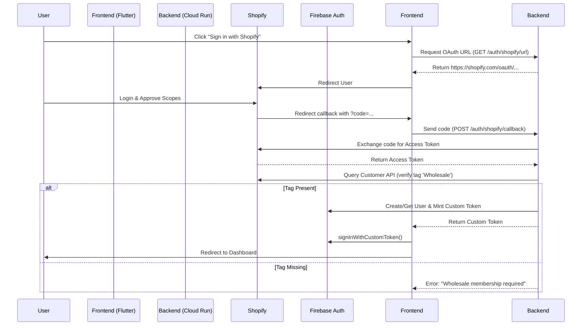

# Shopify OAuth Integration Plan

## Overview
Enable Wholesalers (Members) to sign in using their existing Shopify credentials. This streamlines access by reusing the authentication mechanism they are already familiar with from the main Croma store.

## Technical Architecture

### 1. Authentication Flow (Authorization Code Flow)



### 2. Backend Implementation (Dart/Shelf)

- **Endpoints:**
  - `GET /auth/shopify/url`: Generates the Shopify OAuth authorization URL with state parameter.
  - `POST /auth/shopify/callback`: Handles the redirect code, exchanges it, and mints a Firebase session.

- **Dependencies:**
  - `http`: For calling Shopify APIs.
  - `firebase_admin`: For minting custom authentication tokens.

- **Environment Variables:**
  - `SHOPIFY_CLIENT_ID`
  - `SHOPIFY_CLIENT_SECRET`
  - `SHOPIFY_SHOP_DOMAIN` (e.g., `croma.myshopify.com`)
  - `APP_URL` (for callback redirection)

### 3. Frontend Implementation (Flutter)

- **UI:**
  - Add "Sign in with Shopify" button to `LoginScreen`.
  
- **Logic (`AuthRepository`):**
  - `loginWithShopify()`: Triggers the flow.
  - Handle the deep link/redirect back to the app (using `app_links` or `go_router` deep linking).

### 4. Database & User Model

- **Firestore User Document:**
  - Store `shopifyCustomerId` to link the accounts.
  - Update `role` to `wholesaler` automatically upon successful tag verification.

---

## 5. Alternative: Email-Based Account Linking (Magic Link Sync)

If the user signs in via **Email Magic Link**, we can automatically sync their Shopify data without requiring a separate "Sign in with Shopify" flow.

### Workflow
1.  User signs in via Magic Link (email is verified).
2.  Backend (Cloud Function / Cloud Run) is triggered (e.g., `onUserCreated` or explicit sync endpoint).
3.  Backend queries Shopify Admin API: `GET /admin/api/2024-01/customers/search.json?query=email:{email}`.
4.  **If Match Found:**
    - Retrieve Shopify Customer ID, Tags, Default Address.
    - Update Firestore User Document:
      ```json
      {
        "shopifyId": "gid://shopify/Customer/123456789",
        "role": "wholesaler", // If tag 'Wholesale' exists
        "savedAddress": { ... } // From Shopify default address
      }
      ```
5.  **If No Match:** User remains a basic user (or we prompt them to contact support).

### Required Credentials
To implement this, we need a **Shopify Admin API Access Token** (not just OAuth client secret).

- **Scope:** `read_customers`
- **Type:** Admin API Access Token (begins with `shpat_...`)

---

## Implementation Steps

### Phase 1: Shopify App Setup (Manual)
1.  Create a Custom App in the Croma Shopify Admin.
2.  Enable API scopes: `read_customers`.
3.  Get Client ID and Client Secret.
4.  Configure Allowed Redirection URLs (match Cloud Run domain).

### Phase 2: Backend Development
1.  [ ] Implement `ShopifyService` to handle OAuth handshake.
2.  [ ] Implement `GET /auth/shopify/url` handler.
3.  [ ] Implement `POST /auth/shopify/callback` handler:
    - Exchange code for token.
    - Fetch customer details (`query { customer { id tags email } }`).
    - Verify `Wholesale` tag.
    - Mint Firebase Custom Token.

### Phase 3: Frontend Development
1.  [ ] Add "Sign in with Shopify" button.
2.  [ ] Handle OAuth redirect (launch URL in browser/popup).
3.  [ ] Create a `/auth/callback` route in Flutter to capture the `code`.
4.  [ ] Call backend with `code` and sign in with the returned Custom Token.

### Phase 4: Testing & Security
1.  [ ] Verify state parameter to prevent CSRF.
2.  [ ] Test with non-wholesaler account (should fail).
3.  [ ] Test with valid wholesaler account (should succeed).

---

## Risks & Mitigations

| Risk | Mitigation |
|------|------------|
| **Tag Changes:** Shopify tags might change manually. | Re-verify tags on every login, or set up a Shopify Webhook (`customers/update`) to sync status. |
| **Token Leaks:** Access token exposure. | Backend handles all token exchanges; Frontend only sees Firebase Custom Token. |
| **Redirect Issues:** App not opening on mobile. | Use Universal Links / App Links for robust mobile deep linking. |
