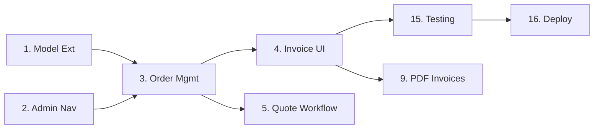

# WS-Seeker — Task Roadmap

```mermaid
graph TD
    subgraph done["Completed"]
        style done fill:#d4edda,stroke:#28a745
        AUTH["Auth (Magic Link)"]
        MODELS["Shared Models & DTOs"]
        MIDDLEWARE["Auth & Role Middleware"]
        ORDER_BE["Order Endpoints (Backend)"]
        ORDER_FE["Order Form UI (3-step wizard)"]
        ORDER_REPO["HttpOrderRepository"]
        ORDER_DETAIL["Order Detail Screen"]
        COMMENTS_BE["Comments Backend"]
        COMMENTS_FE["Comments UI"]
        INVOICE_BE["Invoice Generation Backend"]
        PRODUCTS_BE["Product CRUD Backend"]
        PRODUCTS_FE["Product Management UI"]
        PRODUCTS_SEED["Product Seed Script (292 products)"]
        PRODUCTS_BLOC["ProductsBloc + HttpProductRepository"]
        ROUTER["Router & Theme"]
        SERVER["Backend Server Scaffold"]
    end

    subgraph phase1["Phase 1 — Critical (Admin Can't Work Without These)"]
        style phase1 fill:#f8d7da,stroke:#dc3545
        T1["1. Order Model Extensions"]
        T2["2. Admin Navigation & Layout"]
        T3["3. Order Management Screen"]
        T4["4. Invoice UI"]
    end

    subgraph phase2["Phase 2 — Core Workflow"]
        style phase2 fill:#fff3cd,stroke:#ffc107
        T5["5. Quote Workflow"]
        T6["6. Shipping Cost Breakdown"]
        T7["7. Supplier Dashboard (Mimi)"]
        T8["8. Payment Proof Upload"]
    end

    subgraph phase3["Phase 3 — Polish & Automation"]
        style phase3 fill:#d1ecf1,stroke:#17a2b8
        T9["9. PDF Invoice Generation"]
        T10["10. Email Notifications"]
        T11["11. Display Order Numbers"]
        T12["12. Product Catalog Sync"]
        T13["13. Pricing Engine (JPY/USD, 13% markup)"]
        T14["14. Saved Address / Profile"]
    end

    subgraph launch["Launch"]
        style launch fill:#e2d5f1,stroke:#6f42c1
        T15["15. Testing"]
        T16["16. Deployment"]
    end

    %% Phase 1 dependencies
    MIDDLEWARE --> T2
    ORDER_BE --> T1
    T1 --> T3
    T2 --> T3
    INVOICE_BE --> T4
    T3 --> T4

    %% Phase 2 dependencies
    T3 --> T5
    T1 --> T6
    T2 --> T7
    T3 --> T8

    %% Phase 3 dependencies
    T4 --> T9
    T4 --> T10
    T8 --> T10
    T1 --> T11
    PRODUCTS_FE --> T13
    ORDER_FE --> T14

    %% Launch dependencies
    T3 --> T15
    T4 --> T15
    T15 --> T16
```

## Task Details

### Phase 1: Critical

| # | Task | Depends On | Blocks | Description |
|---|------|-----------|--------|-------------|
| 1 | Order Model Extensions | Order Backend (done) | 3, 6, 11 | Add shippingMethod, paymentMethod, discordName, adminNotes, displayOrderNumber fields. Add `cancelled` and `awaitingQuote` to OrderStatus enum. |
| 2 | Admin Navigation & Layout | Auth Middleware (done) | 3, 7 | Shell widget with NavigationRail: Dashboard, Orders, Products, Invoices. Route updates. |
| 3 | Order Management Screen | Tasks 1, 2 | 4, 5, 8, 15 | **PRIMARY spreadsheet replacement.** Filterable order list, inline status changes, tracking input, admin notes. Replaces Chinese tab (CN1–CN34), Korean tab (KR1–KR12), and Taylor tracking. |
| 4 | Invoice UI | Invoice Backend (done), Task 3 | 9, 10, 15 | Invoice builder matching CROMA WHOLESALE template. Line items, shipping cost breakdown (air/ocean + tariffs), send to customer. |

### Phase 2: Core Workflow

| # | Task | Depends On | Blocks | Description |
|---|------|-----------|--------|-------------|
| 5 | Quote Workflow | Task 3 | — | Quote builder: product × qty × price, shipping estimate. Customer approval flow. `awaitingQuote` status. |
| 6 | Shipping Cost Breakdown | Task 1 | — | airShippingCost, oceanShippingCost, tariffAmount fields on Order/Invoice. Shown as separate invoice lines. |
| 7 | Supplier Dashboard (Mimi) | Task 2 | — | JPN-filtered order/product view for supplier role. |
| 8 | Payment Proof Upload | Task 3 | 10 | File upload to Cloud Storage. Display proof inline on order detail. |

### Phase 3: Polish & Automation

| # | Task | Depends On | Blocks | Description |
|---|------|-----------|--------|-------------|
| 9 | PDF Invoice Generation | Task 4 | — | PDF matching CROMA WHOLESALE template. Download + Cloud Storage. |
| 10 | Email Notifications | Tasks 4, 8 | — | Invoice ready, payment received, tracking available. Via Resend. |
| 11 | Display Order Numbers | Task 1 | — | Auto-generated CN35, KR13, JPN164 etc. Sequential counters per language. |
| 12 | Product Catalog Sync | — | — | Reconcile CN Price Sheet (~115 products from Spreadsheet 2) with existing imports. |
| 13 | Pricing Engine | Products (done) | — | 13% markup (CN/KR), JPY→USD conversion, tariff estimation. |
| 14 | Saved Address / Profile | Order Form (done) | — | Save/reuse shipping address. Discord name on profile. |

### Launch

| # | Task | Depends On | Description |
|---|------|-----------|-------------|
| 15 | Testing | Tasks 3, 4 | End-to-end order flow, invoice generation, role-based access. |
| 16 | Deployment | Task 15 | Cloud Run deploy, domain setup, production Firestore rules. |

## Critical Path

## What Each Phase Replaces

| Phase | Spreadsheet Tabs Replaced |
|-------|--------------------------|
| Phase 1 | Chinese orders, Korean orders, Taylor tracking, Invoice template |
| Phase 2 | Quote workflow (embedded in order tabs), shipping method/cost columns |
| Phase 3 | Sequential order numbering, email notifications, PDF invoices |
| Products (done) | JPN Price Sheet, CN Official Product, CN Fan Art Product, KR Price Sheet, KR Formula Sheet, CN Price Sheet |
