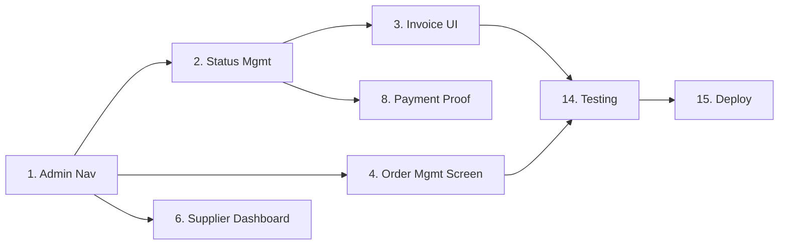

# WS-Seeker — Task Roadmap

```mermaid
graph TD
    subgraph done["Completed"]
        style done fill:#d4edda,stroke:#28a745
        AUTH["Auth (Magic Link)"]
        MODELS["Shared Models & DTOs"]
        MIDDLEWARE["Auth & Role Middleware"]
        ORDER_BE["Order Endpoints (Backend)"]
        ORDER_FE["Order Form UI (3-step wizard)"]
        ORDER_REPO["HttpOrderRepository"]
        ORDER_DETAIL["Order Detail Screen"]
        COMMENTS_BE["Comments Backend"]
        COMMENTS_FE["Comments UI"]
        INVOICE_BE["Invoice Generation Backend"]
        PRODUCTS_BE["Product CRUD Backend"]
        PRODUCTS_LIST["Product Listing Frontend"]
        ROUTER["Router & Theme"]
        SERVER["Backend Server Scaffold"]
    end

    subgraph critical["Critical — Admin Can't Work Without These"]
        style critical fill:#f8d7da,stroke:#dc3545
        T1["1. Admin Navigation & Layout"]
        T2["2. Order Status Management"]
        T3["3. Invoice UI"]
        T4["4. Order Management Screen"]
    end

    subgraph important["Important — Core Workflow"]
        style important fill:#fff3cd,stroke:#ffc107
        T5["5. Product Mgmt Polish"]
        T6["6. Supplier Dashboard (Mimi)"]
        T7["7. Saved Address / Profile"]
        T8["8. Payment Proof Upload"]
    end

    subgraph stretch["Stretch / Deferred"]
        style stretch fill:#d1ecf1,stroke:#17a2b8
        T9["9. Pricing & Currency (Jules)"]
        T10["10. Email Notifications"]
        T11["11. PDF Invoices"]
        T12["12. User Management"]
        T13["13. Data Retention & Filters"]
    end

    subgraph launch["Launch"]
        style launch fill:#e2d5f1,stroke:#6f42c1
        T14["14. Testing"]
        T15["15. Deployment"]
    end

    %% Dependencies from completed work
    MIDDLEWARE --> T1
    ORDER_BE --> T2
    ORDER_BE --> T4
    INVOICE_BE --> T3
    PRODUCTS_BE --> T5
    MIDDLEWARE --> T6
    ORDER_FE --> T7
    AUTH --> T7

    %% Critical path dependencies
    T1 --> T4
    T1 --> T6
    T2 --> T3
    T3 --> T11
    T2 --> T8

    %% Important dependencies
    T5 --> T9
    T3 --> T10
    T8 --> T10

    %% Launch dependencies
    T2 --> T14
    T3 --> T14
    T4 --> T14
    T14 --> T15
```

## Dependency Summary

| Task | Depends On | Blocks |
|------|-----------|--------|
| 1. Admin Nav | Auth/Role Middleware (done) | 4, 6 |
| 2. Order Status Mgmt | Order Endpoints (done) | 3, 8, 14 |
| 3. Invoice UI | Invoice Backend (done), Task 2 | 10, 11, 14 |
| 4. Order Mgmt Screen | Order Endpoints (done), Task 1 | 14 |
| 5. Product Mgmt Polish | Product CRUD (done) | 9 |
| 6. Supplier Dashboard | Auth Middleware (done), Task 1 | — |
| 7. Saved Address | Order Form + Auth (done) | — |
| 8. Payment Proof Upload | Task 2 | 10 |
| 9. Pricing & Currency | Task 5 | — |
| 10. Email Notifications | Tasks 3, 8 | — |
| 11. PDF Invoices | Task 3 | — |
| 12. User Management | — | — |
| 13. Data Retention | — | — |
| 14. Testing | Tasks 2, 3, 4 | 15 |
| 15. Deployment | Task 14 | — |

## Critical Path

